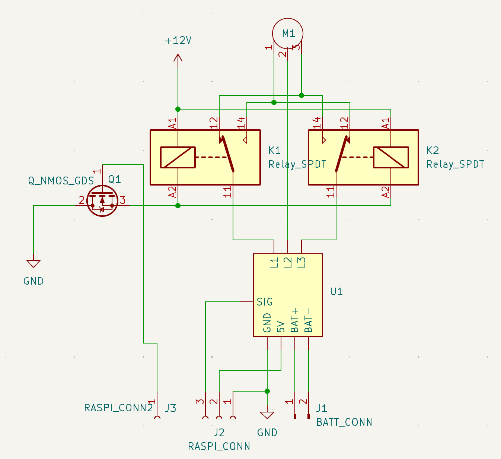

# Metodologias
## Metodologias/procedimentos/técnicas
Até ao momento o grupo tem estado dividido entre dois componentes fundamentais do projeto, a montagem e testagem do BLDC e do seu circuito de controlo, e a montagem, testagem e investigação necessária para o desenvolvimento do prototipo do MHD contudo têm havido processos a correr em parallelo como a modelação 3d do chassis e a escrita do relatório.

### Montagem/Testagem do Motor (BLDC)
O processo de montagem do circuito de controlo do BLDC passou por soldar o circuito, cujo diagrama se encontra na imagem abaixo, constituido por um controlador de velocidade eletronico (U1), o próprio BLDC (M1), dois relês automóveis (K1, K2) (que permitem a inversão do sentido de rotação do BLDC, atravéz da inversão da ordem das fases nas bobines do motor) e um mosfet (Q1) que permite o acionamento simultaneo dos dois relês (que são operados a 12V) com uma voltagem de controlo de 5V.

Quanto á testagem, esta está a ser feita através da ligação do esc e do mosfet a um micro-computador raspberry pi 4 e utilizando uma bateria S3 para alimentar o motor, a mesma que alimentará este na versão final do projeto, e dos relês através de uma fonte de alimentação externa, que será substituida por um boost converter alimentado pela mesma bateria S3 na versão final. Estamos neste momento a testar variações do codigo para tentar meter o motor a rodar e como tal não podemos fornecer ainda nem o codigo nem o diagrama de ligação ao raspberry pi.

### Montagem/Testagem do MHD
O MHD é cosntituido por dois imanes de neodímio isolados com fita de poliamida orientados paralelamente, de tal modo a obter o campo magnético mais uniforme possivel, estando estes separados por duas chapas de latão colocadas prependicularmente aos imanes, sendo estrutura toda suportada por mais fita de poliamida. Anteriormente foi usado fita isoladora em vez de fita de poliamida mas esta degradava-se na presença de um dos produtos resultantes da reação quimmica que ocorre secundáriamente ao funcionamento do MHD, a eletrolise da áqua salgada, que liberta cloro e e hidróxido de sódio (embora em quantidades muito reduzidas comparativamente com o volume de água disponivel).
No MHD as barras de latão servem como eletrodos que geram um campo elétrico, O funcionamento do MHD resulta da aplicação de uma força de Lorentz nos iões de sódio presentes na água, sendo esta igual ao produto externo entre a densidade de corrente e o campo magnetico, sendo assim o MHD mais efficiente quando o campo elétrico encontra-se prependicular ao campo magnético.
A testagem do MHD passou pela submerção deste numa caixa cheia de água salgada á salinidade de \\(\approx 35g/L)\\ , a salinidade do oceano atlântico, e pela alimentação do MHD a partir de uma fonte de alimentação externa a 24V, observando a velocidade de saida de "bolhas" criadas pelos gases resultantes da eletrolise que acontece paralelamente devido á presença de um campo eletrico. Esta medição de velocidade não foi rigorosa sendo apenas um indicador aproximado do funcionamento do MHD. No futuro, tencionamos colar o MHD a uma plataforma flutuante para avaliar o seu verdadeiro potencial enquanto método de propulsão.

## Dificuldades Encontradas

- Dificuldade em soldar certas partes do circuito de controlo do MHD, devido a falta de prática recente pela pessoa a soldar.
- Curto circuito no MHD devido a mau isolamento dos imanes em relação ás barras de cobre, problema que levou demasiado tempo a diagnosticar.
- Libertação de oxidos de latão soluveis em água, de cor verde, por parte do MHD, poderá ser resolvido atravéz da utilização de um anodo sacrificial non interior da embarcação.

## Materiais
### Presentemente em utilização

- 2 relés automóveis
- 1 ESC (electronic speed controller)
- 1 N-MOSFET
- 1 BLDC
- 1 Raspberry pi 4
- 2 Barras de latão
- Cabos Dupont
- Fita Kapton
- Fita Isoladora

## Cronograma de atividade atualizado
(---)

## Identificar o contributo individual de cada membro para o desenvolvimento do projeto	
- João Ferreira
	- Montagem e soldagem do circuito de controlo do BLDC
	- Modelação 3D

- Luís Henriques
	- Montagem e testagem do MHD, bem como investigação sobre como fazer o mesmo.
	- Diagramas de Circuito

- Pedro Tereno
	- Asistencia na montagem do MHD e do circuito de controlo do BLDC quando necessária
	- Organização do relatório e da informação pretinente ao mesmo
