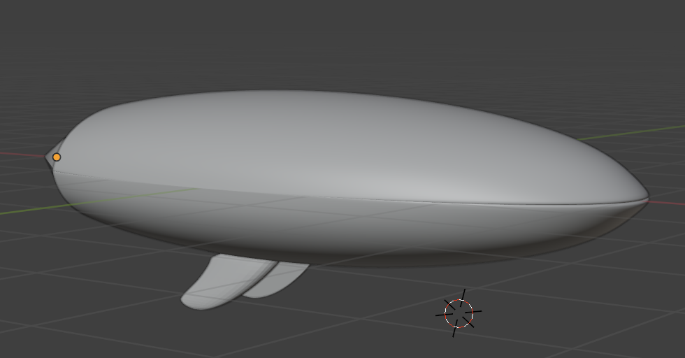
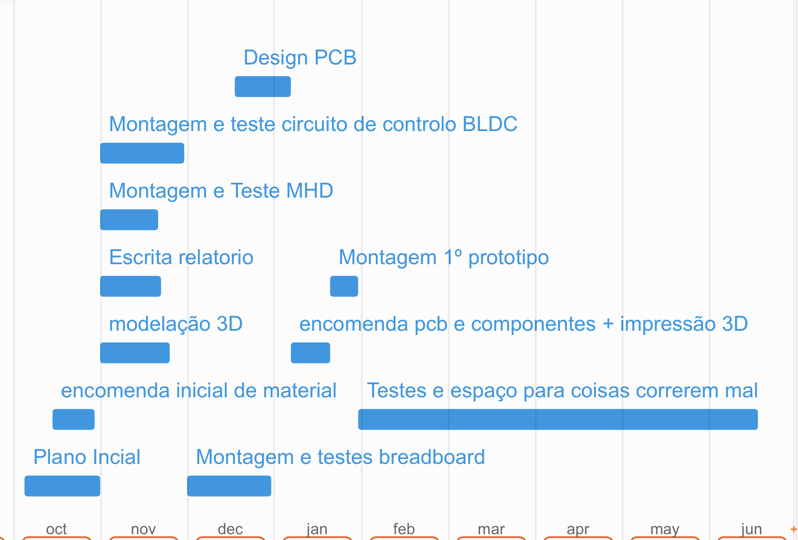

# Metodologias
## Metodologias/procedimentos/técnicas
Até ao momento o grupo tem estado dividido entre dois componentes fundamentais do projeto, a montagem e testes do BLDC e do seu circuito de controlo, e a montagem, testes e investigação necessária para o desenvolvimento do prototipo do MHD contudo têm havido processos a correr em paralelo como a modelação 3D do chassis e a escrita do relatório.

### Montagem/testes do Motor (BLDC)
O processo de montagem do circuito de controlo do BLDC passou por soldar o circuito, cujo diagrama se encontra na imagem abaixo, constituído por um controlador de velocidade electrónico (U1), o próprio BLDC (M1), dois relés automóveis (K1, K2) (que permitem a inversão do sentido de rotação do BLDC, através da inversão da ordem das fases nas bobines do motor) e um MOSFET (Q1) que permite o accionamento simultâneo dos dois relés (que são operados a 12V) com uma voltagem de controlo de 5V.

Quanto à testes, esta está a ser feita através da ligação do ESC e do MOSFET a um micro computador raspberry pi 4 e utilizando uma bateria S3 para alimentar o motor, a mesma que alimentará este na versão final do projeto, e dos relés através de uma fonte de alimentação externa, que será substituída por um boost converter alimentado pela mesma bateria S3 na versão final. Estamos neste momento a testar variações do código para tentar meter o motor a rodar e como tal não podemos fornecer ainda nem o código nem o diagrama de ligação ao raspberry pi.

### Montagem/testes do MHD
O MHD é constituído por dois ímanes de neodímio isolados com fita de poliamida orientados paralelamente, de tal modo a obter o campo magnético mais uniforme possível, estando estes separados por duas chapas de latão colocadas perpendicularmente aos ímanes, sendo estrutura toda suportada por mais fita de poliamida. Anteriormente foi usado fita isoladora em vez de fita de poliamida mas esta degradava-se na presença de um dos produtos resultantes da reação química que ocorre secundariamente ao funcionamento do MHD, a electrólise da água salgada, que liberta cloro e e hidróxido de sódio (embora em quantidades muito reduzidas comparativamente com o volume de água disponível).
No MHD as barras de latão servem como elétrodos que geram um campo elétrico, O funcionamento do MHD resulta da aplicação de uma força de Lorentz nos iões de sódio presentes na água, sendo esta igual ao produto externo entre a densidade de corrente e o campo magnético, sendo assim o MHD mais eficiente quando o campo elétrico encontra-se perpendicular ao campo magnético.
A testes do MHD passou pela submersão deste numa caixa cheia de água salgada à salinidade de \\(\approx 35g/L)\\ , a salinidade do oceano atlântico, e pela alimentação do MHD a partir de uma fonte de alimentação externa a 24V, observando a velocidade de saída de "bolhas" criadas pelos gases resultantes da electrólise que acontece paralelamente devido à presença de um campo elétrico. Esta medição de velocidade não foi rigorosa sendo apenas um indicador aproximado do funcionamento do MHD. No futuro, tencionamos colar o MHD a uma plataforma flutuante para avaliar o seu verdadeiro potencial enquanto método de propulsão.

### Modelação 3D
A nossa modelação 3D foi feita no blender e neste momento temos modelos para os pesos das reaction wheels e para o exterior do chassis do primeiro prototipo, que pode ser vistos nas imagens abaixo.

### Relatório e File Sharing
O nosso relatório foi feito em markdown e exportado para pdf e, tal como todos os nossos outros ficheiros e cronograma foi trabalhado e sincronizado entre membros da equipa utilizando o git com a plataforma de cloud hosting de git da microsoft "GitHub".

## Dificuldades Encontradas

- Dificuldade em soldar certas partes do circuito de controlo do MHD, devido a falta de prática recente pela pessoa a soldar.
- Curto circuito no MHD devido a mau isolamento dos ímanes em relação ás barras de cobre, problema que levou demasiado tempo a diagnosticar.
- Libertação de óxidos de latão solúveis em água, de cor verde, por parte do MHD, poderá ser resolvido através da utilização de um ânodo sacrificial no interior da embarcação.

## Materiais
### Presentemente em utilização

- 2 relés automóveis
- 1 ESC (electronic speed controller)
- 1 N-MOSFET
- 1 BLDC
- 1 Raspberry pi 4
- 2 Barras de latão
- Cabos Dupont
- Fita Kapton
- Fita Isoladora

## Cronograma de atividade atualizado

## Identificar o contributo individual de cada membro para o desenvolvimento do projeto	
- João Ferreira
	- Montagem e soldagem do circuito de controlo do BLDC
	- Modelação 3D

- Luís Henriques
	- Montagem e testes do MHD, bem como investigação sobre como fazer o mesmo.
	- Diagramas de Circuito

- Pedro Tereno
	- Assistência na montagem do MHD e do circuito de controlo do BLDC quando necessária
	- Organização do relatório e da informação pertinente ao mesmo
